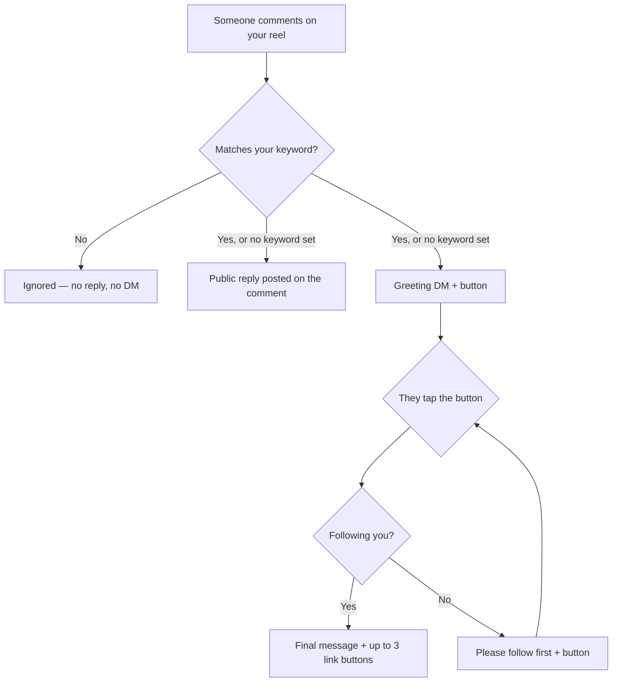

# AutoFlow

Instagram comment-to-DM automation. Pick a reel; when someone comments on it, the
account replies publicly, slides into their DMs, and gates the payoff behind a
follow check — every message configurable per reel.

Think ManyChat's comment automation, self-hosted, on free infrastructure.

## The flow



The final message is unreachable until a follow is actually confirmed — tapping
the button while not following just loops on the retry message.

**Everyone gets the greeting**, including people who already follow you. That
isn't a design choice: the follow check needs an open conversation, and the
button tap is what opens it (see the constraints below).

## What you configure, per reel

| Step | Field | Goes out as |
|---|---|---|
| 0 | `keywords` | *Filter* — only comments containing one of these trigger anything. Empty = respond to every comment |
| 1 | `commentReplyText` ×3 | Public reply on the comment; a random non-empty variant each time |
| 2 | `greetingMessage` + `greetingButtonText` | First DM, with a button |
| 3 | `followMessage` | If they're not following on the first tap |
| 4 | `followRetryMessage` | Every tap after that, until they follow |
| 5 | `detailsMessage` + `detailsButtons` | The payoff, with up to 3 link buttons, once following is confirmed |

Each reel gets its own copy, so different reels can offer different things.
**Copy from reel** clones one reel's whole setup onto another.

## Flows for reels you haven't posted yet

The **Upcoming reels** page holds an ordered queue of prepared flows. When a new
reel appears, the flow at the front is copied onto it and **used up**:

```
Prepared:  [1] Flow A   [2] Flow B
upload reel → gets Flow A (consumed)
upload reel → gets Flow B (consumed)
upload reel → queue empty → no automation at all
```

Flows can be named, edited, deleted and reordered. Attaching runs in a
transaction, so two reels arriving together can't claim the same flow. A reel
posted with an empty queue is deliberately left alone.

## Catching up on old comments

A reel configured *after* it started collecting comments would otherwise skip
everyone who commented first. **Comments from before setup** sweeps them, with a
dry-run preview showing exactly what would be sent and why each comment was
skipped. It also runs once automatically the first time a reel goes Live.

Comments older than **7 days** are left entirely alone — Instagram refuses the
DM past that, and posting a public "sent you a DM!" reply that can never be
honoured would be worse than silence.

## Instagram constraints worth knowing

These shaped the implementation and aren't obvious from the docs:

**There is no followers endpoint.** Meta has never exposed one. The only
supported way to check whether someone follows you is `is_user_follow_business`
on the Messaging user profile, and that requires consent — which is *"set only
when an Instagram user sends a message to your app user, or clicks an icebreaker
or persistent menu"*. A comment doesn't count. That's why the follow check runs
after they tap a button, never at comment time, and why the greeting can't be
skipped for existing followers. It fails closed: a lookup error counts as "not
following", so the gate holds.

**You can't DM someone just because they commented.** Instagram only allows
messaging inside a 24-hour window opened by *their* last message. So the first DM
is sent as a **private reply** addressed to the comment id — the one message
Instagram permits off the back of a comment, usable **once per comment** and only
**within 7 days** of it. Everything after that is a normal DM inside the window
their tap opens.

**Configuring the webhook URL isn't enough.** The account must also be subscribed
via `/{ig-user-id}/subscribed_apps`, or Instagram delivers nothing and the
automation silently never fires. The app does this when you connect an account.

**Rate limits.** 750 private replies per hour per account — that's the ceiling on
new people entering the funnel, since each needs exactly one. Follow-up DMs run
under the Send API at 100/second, and public replies under the general limit of
4,800 × impressions per 24h. Meta charges nothing for any of it. There is
currently **no queue or retry** if the hourly cap is hit; a failed send is
recorded on the conversation and surfaced in the editor.

**Buttons.** The button template allows at most three, so a fourth is dropped
locally rather than sent and rejected.

## Stack

- **Next.js** (App Router) + TypeScript
- **Prisma** + PostgreSQL — free tier on [Prisma Postgres](https://www.prisma.io/postgres)
- **NextAuth** — passwordless email-OTP sign-in, locked to one address
- **Resend** — delivers the login code email
- **Tailwind** + Radix UI
- **Instagram API with Instagram Login** — comments, messaging, profile

Runs at zero cost on free tiers. The binding limit is the database: at roughly
15–23 queries per completed journey, 100,000 operations/month works out to
**about 5,000 comments a month**.

## Quick start

Requires **Node ≥ 20.9**.

```bash
npm install
cp .env.example .env    # fill in the values below
npm run db:push         # create the schema
npm run dev
```

Tests need no database and no credentials — the Prisma client and the Graph API
are mocked, so the flow engine is driven entirely in memory:

```bash
npm test          # once
npm run test:watch
```

Instagram webhooks need a public HTTPS URL, so for local testing put a tunnel in
front of it (`cloudflared tunnel --url http://localhost:3000`) and use that URL
for `NEXTAUTH_URL` and in the Meta dashboard.

**[SETUP.md](./SETUP.md)** has the full walkthrough; **[GO-LIVE.md](./GO-LIVE.md)**
covers deploying to Vercel.

### Environment

| Variable | What it's for |
|---|---|
| `DATABASE_URL` | Postgres connection string |
| `NEXTAUTH_URL` / `NEXTAUTH_SECRET` | Session handling (`openssl rand -base64 32`) |
| `ALLOWED_LOGIN_EMAIL` | The only email allowed to sign in |
| `RESEND_API_KEY` | Sends the login-code email ([resend.com](https://resend.com)) |
| `INSTAGRAM_APP_ID` / `INSTAGRAM_APP_SECRET` | Instagram OAuth + webhook signature verification |
| `META_WEBHOOK_VERIFY_TOKEN` | Any random string; must match the Meta dashboard |
| `CRON_SECRET` | Protects the scheduled `/api/cron/*` routes |

A missing `INSTAGRAM_APP_SECRET` makes every webhook fail signature validation
with a silent 401 — no reply, no DM, no visible error. To check a deployment,
POST a correctly signed empty payload and expect a 200:

```bash
BODY='{"object":"instagram","entry":[]}'
SIG=$(printf '%s' "$BODY" | openssl dgst -sha256 -hmac "$INSTAGRAM_APP_SECRET" -hex | sed 's/^.*= //')
curl -X POST "$APP_URL/api/webhooks/instagram" \
  -H 'content-type: application/json' \
  -H "x-hub-signature-256: sha256=$SIG" -d "$BODY"
```

## Project structure

```
app/
  (dashboard)/
    dashboard/        overview
    posts/            your media, and the per-reel flow editor
    queue/            flows prepared for reels not yet uploaded
    settings/         connect / disconnect Instagram
  api/
    auth/otp/         request a login code
    automations/      CRUD for per-reel flows
      [id]/copy-from  clone another reel's setup onto this one
      [id]/backfill   sweep comments predating the automation
    flows/            the prepared-flow queue (CRUD + reorder)
    instagram/        OAuth connect, callback, posts
    cron/             daily token refresh + post sync
    webhooks/         Instagram event receiver
lib/
  flow-engine.ts      conversation state machine
  instagram.ts        Graph API client
  keywords.ts         the per-reel comment filter
  buttons.ts          final-message buttons (max 3, legacy fallback)
  backfill.ts         catching up on pre-existing comments
  templates.ts        claim the next queued flow for a new reel
  otp.ts / email.ts   email-OTP login codes
  auth.ts             NextAuth config
prisma/
  schema.prisma       User, InstagramAccount, PostAutomation, Conversation,
                      QueuedFlow, LoginCode
tests/
  flow-engine.test.ts the state machine, db + Graph API mocked
  keywords.test.ts    the per-reel comment filter
  buttons.test.ts     button resolution and the legacy fallback
  backfill.test.ts    the 7-day window and duplicate guards
```

`PostAutomation` is one reel's flow; `Conversation` tracks one person's progress
through it (`greeted` → `follow_requested` → `completed`). `QueuedFlow` is a flow
waiting for a reel you haven't posted yet.

## Security

- Webhook deliveries are rejected unless they carry a valid `X-Hub-Signature-256`
  for the app secret — otherwise anyone knowing the URL could make the account DM
  arbitrary people.
- The account's own comments are ignored, so its public reply can't trigger itself.
- Duplicate deliveries are dropped, so Meta's retries don't double-post or re-DM.
- Backfill checks three ways before sending: an existing conversation for the
  comment, a reply already posted by the account, and the account's own comments.

## Status

Running live against a real Instagram account, with the full journey confirmed
end to end — comment → public reply → greeting DM → follow gate → final message,
including a follow earned through the gate.

Known gaps:

- [ ] No queueing or retry when the 750/hour private-reply limit is hit — those
      people are dropped, with the failure recorded on the conversation
- [ ] Comments older than 7 days can't be reached at all
- [ ] Meta App Review is only needed to serve accounts you don't own — a single
      account in Development mode with itself as a tester does not need it

The Instagram account must be a **Business or Creator** account. Personal
accounts can't use these APIs at all.
