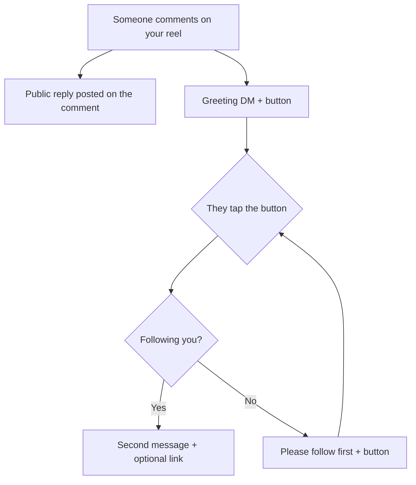

# AutoFlow

Instagram comment-to-DM automation. Pick a reel; when someone comments on it, the
account replies publicly, slides into their DMs, and gates the payoff behind a
follow check — every message configurable per reel.

Think ManyChat's comment automation, self-hosted, on free infrastructure.

## The flow



The second message is unreachable until a follow is actually confirmed — tapping
the button while not following just loops on the retry message.

## What you configure, per reel

| Step | Field | Goes out as |
|---|---|---|
| 1 | `commentReplyText` | Public reply on the comment |
| 2 | `greetingMessage` + `greetingButtonText` | First DM, with a button |
| 3 | `followMessage` | If they're not following on the first tap |
| 4 | `followRetryMessage` | Every tap after that, until they follow |
| 5 | `detailsMessage` + `detailsButtonText` + `detailsUrl` | The payoff, once following is confirmed |

Each reel gets its own copy, so different reels can offer different things.

## Three Instagram constraints worth knowing

These shaped the implementation and aren't obvious from the docs:

**There is no followers endpoint.** Meta has never exposed one. The only supported
way to check whether someone follows you is `is_user_follow_business` on the
Messaging user profile — which only works for people with an open conversation.
That's why the follow check runs *after* they tap a button, never at comment time.
It fails closed: a lookup error is treated as "not following", so the gate holds.

**You can't DM someone just because they commented.** Instagram only allows
messaging inside a 24-hour window opened by *their* last message. So the first DM
is sent as a **private reply** addressed to the comment id — the one message
Instagram permits off the back of a comment, usable once per comment. Everything
after that is a normal DM inside the window their tap opens.

**Configuring the webhook URL isn't enough.** The Page must also be subscribed via
`/{page-id}/subscribed_apps`, or Instagram delivers nothing and the automation
silently never fires. The app does this when you connect an account.

## Stack

- **Next.js** (App Router) + TypeScript
- **Prisma** + PostgreSQL — free tier on [Neon](https://neon.tech)
- **NextAuth** — Google sign-in only
- **Tailwind** + Radix UI
- **Instagram Graph API** — comments, messaging, profile

Built to run at zero cost: Neon free tier + Vercel free tier.

## Quick start

Requires **Node ≥ 20.9**.

```bash
npm install
cp .env.example .env    # fill in the values below
npm run db:push         # create the schema
npm run dev
```

Instagram webhooks need a public HTTPS URL, so for local testing put a tunnel in
front of it (`cloudflared tunnel --url http://localhost:3000`) and use that URL
for `NEXTAUTH_URL` and in the Meta dashboard.

**[SETUP.md](./SETUP.md)** has the full walkthrough: Neon, Google OAuth, the Meta
app, required permissions, and which webhook fields to subscribe.

### Environment

| Variable | What it's for |
|---|---|
| `DATABASE_URL` | Neon Postgres connection string |
| `NEXTAUTH_URL` / `NEXTAUTH_SECRET` | Session handling (`openssl rand -base64 32`) |
| `GOOGLE_CLIENT_ID` / `GOOGLE_CLIENT_SECRET` | Google sign-in |
| `META_APP_ID` / `META_APP_SECRET` | Instagram OAuth + webhook signature verification |
| `META_WEBHOOK_VERIFY_TOKEN` | Any random string; must match the Meta dashboard |

## Project structure

```
app/
  (dashboard)/
    dashboard/        overview
    posts/            your media, and the per-reel flow editor
    settings/         connect / disconnect Instagram
  api/
    automations/      CRUD for per-reel flows
    instagram/        OAuth connect, callback, posts
    webhooks/         Instagram event receiver
lib/
  flow-engine.ts      conversation state machine
  instagram.ts        Graph API client
  auth.ts             NextAuth config
prisma/
  schema.prisma       User, InstagramAccount, PostAutomation, Conversation
```

`PostAutomation` is one reel's flow; `Conversation` tracks one person's progress
through it (`greeted` → `follow_requested` → `completed`).

## Security

- Webhook deliveries are rejected unless they carry a valid `X-Hub-Signature-256`
  for the app secret — otherwise anyone knowing the URL could make the account DM
  arbitrary people.
- The account's own comments are ignored, so its public reply can't trigger itself.
- Duplicate deliveries are dropped, so Meta's retries don't double-post or re-DM.

## Status

The flow is complete and builds clean, but **has not yet been run against a live
Instagram account**. Before it works end to end:

- [ ] Meta App Review for `instagram_manage_messages` and `instagram_manage_comments`
      — until approved these only work for accounts with a role on the app
- [ ] Verify the messaging path: sends go to `/{pageId}/messages`; current Meta docs
      use the Instagram professional account id
- [ ] Deploy somewhere with a stable HTTPS URL
- [ ] Automated tests — there are none yet
- [ ] Queueing/rate limiting for reels that get a lot of comments at once

The Instagram account must be a **Business or Creator** account connected to a
Facebook Page. Personal accounts can't use these APIs at all.
