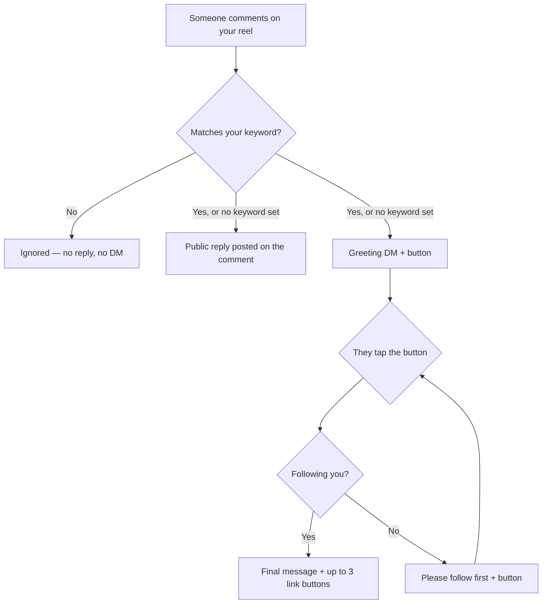

# AutoFlow

Instagram comment-to-DM automation. Pick a reel; when someone comments on it, the
account replies publicly, slides into their DMs, and gates the payoff behind a
follow check — every message configurable per reel.

Think ManyChat's comment automation, self-hosted, on free infrastructure.

## The flow



The final message is unreachable until a follow is actually confirmed — tapping
the button while not following just loops on the retry message.

**Everyone gets the greeting**, including people who already follow you. That
isn't a design choice: the follow check needs an open conversation, and the
button tap is what opens it (see the constraints below).

## What you configure, per reel

| Step | Field | Goes out as |
|---|---|---|
| 0 | `keywords` | *Filter* — only comments containing one of these trigger anything. Empty = respond to every comment |
| 1 | `commentReplyText` ×3 | Public reply on the comment; a random non-empty variant each time. The comment itself is liked at the same time |
| 2 | `greetingMessage` + `greetingButtonText` | First DM, with a button |
| 3 | `followMessage` | If they're not following on the first tap |
| 4 | `followRetryMessage` | Every tap after that, until they follow |
| 5 | `detailsMessage` + `detailsButtons` | The payoff, with up to 3 link buttons, once following is confirmed |

Each reel gets its own copy, so different reels can offer different things.
**Copy from reel** clones one reel's whole setup onto another.

**Reels → Default messages** sets the wording a *new* reel starts from — used
when you hit Configure on a reel, and for newly added prepared flows. It never
touches a reel that already has an automation.

## Starting an automation

**New automation** (sidebar and Dashboard) opens a picker rather than dropping
you on a page:

| Card | Goes to |
|---|---|
| DM on a posted reel | **Reels** — pick the reel, then Configure |
| DM on your next reel | **Automations → Upcoming reels** — prepare a flow for the queue |
| Start from a playbook | **Playbooks** |
| Popular playbooks (chips) | That playbook's setup dialog, straight away |

Story replies, inbox keywords and email capture are listed as **Coming soon**
and can't be clicked — the engine only reacts to comments today.

## Playbooks

Ready-made reel automations: every message in the flow (public replies,
greeting, follow gate, final message) is already written around one keyword.
28 of them in `lib/playbooks.ts`, grouped as Most popular, Free resources,
Sell & earn, Grow & engage, Book & launch and Creator niches — e.g. Freebie drop
(`FREE`), Link in DMs (`LINK`), Secret discount (`CODE`), Buy it now
(`BUY`/`ORDER`), Book a call (`CALL`), AI prompt pack (`PROMPT`).

Picking one asks only what it can't know — the trigger word (pre-filled), the
link and its button label, and where it runs:

- **A posted reel** — creates that reel's automation *switched off* and opens its
  editor, so you review it and go Live there. A reel that already has one is
  only overwritten after a confirm, and keeps its stats and Live switch.
- **My next reel** — adds it to the back of the Upcoming reels queue (Automations → Upcoming reels).

`POST /api/playbooks/apply` does both. Each playbook has its own link
(`/playbooks?playbook=<id>`) that opens its setup dialog directly. Keywords are
chosen with the substring match in mind (`GIVEAWAY`, not `WIN`, which would
match "window"); a test checks every playbook fires on its own sample comment
and that every button label fits in 20 characters.

## Flows (design preview)

**Flows** (routes under `/triggers`) is where the next version of the flow
builder is being worked out. Flows are saved **in this browser only**
(`localStorage`, `lib/trigger-store.ts`) and **send nothing** — live reels still
run on the per-reel automations above.

There are three ways to build one, kept side by side on purpose until one wins:

- **One-page editor** (`/triggers/compose`, the default for New flow and for
  opening a flow) — every setting as a numbered section you can jump to:
  reel, keywords, public reply, opening DM, follow check, final DM. Each DM has
  **Use template** suggestions (`lib/dm-suggestions.ts`) and the page can be
  filled from any playbook. A live Instagram-style phone beside it follows the
  section you're editing — Post, Comments or DM — and can play the DM as a
  follower or a non-follower.
- **Step-by-step** (`/triggers/new`) — three questions, then the canvas.
- **Canvas** (`/triggers/<id>`) — the full graph: branches, DM-started flows,
  multiple buttons.

The one-page editor only handles the standard shape
(`lib/trigger-compose.ts`); a flow the canvas has branched beyond it opens on the
canvas instead, so nothing is flattened away.

## Workspaces & team

Everything — the Instagram account, automations, prepared flows, reel defaults,
conversations — belongs to a **workspace**, not a person. People reach it
through a membership with one of two roles (`lib/roles.ts`):

| Role | Can do |
|---|---|
| Owner | Everything, plus invite and remove people, connect/disconnect Instagram, rename the workspace |
| Member | All day-to-day work: automations, playbooks, upcoming reels, analytics, going Live |

- **Switcher** at the top of the sidebar; **New workspace** creates an empty one
  (one Instagram account per workspace — e.g. a client, or a second page).
- **Settings → Team**: the owner invites by email (Resend) and also gets the link
  to share by hand; cancel, resend, remove. Members can leave.
- **Invites** (`lib/invites.ts`): the owner picks an expiry — 24 hours, 3 days
  or 7 days — and the email (a designed HTML template) states it in the
  inviter's own timezone. A random token is in the link, only its SHA-256 is
  stored, single use, 20 invites per workspace per day; a new invite to the same
  address retires the old link.
- **Joining** at `/invite/<token>` (public): someone signed out just types their
  name and presses Join — the link was sent to their inbox, so it stands in for a
  login code, once (the `invite` credentials provider in `lib/auth.ts`). The
  account is created approved and counted as onboarded, so there's no
  onboarding. Signed in as the invited address it's one click; as another
  address, it offers to log out and join as the right one. Pending invites also
  show in a banner and in the workspace switcher.
- **Onboarding** is only for brand-new users (owner of their one and only
  workspace, no survey, no Instagram — `shouldForceOnboarding`).
- **New workspace** is two steps: name and colour, then Instagram — move an
  account you already connected in another workspace you own (its automations
  move with it), connect a new one, or skip.
- **Leaving**: you can't leave your only workspace — you're asked to create one
  first. What a member built stays in the workspace when they leave or are
  removed; automations belong to the workspace, not the person.
- **Access control** lives in `lib/workspace.ts`: every route resolves the
  current workspace (cookie `af_ws`, re-checked against your memberships) and
  its Instagram account from there. Owner-only routes return 403 to members.
- **No migration script**: the first time an existing user signs in, they get a
  personal workspace (`ws_<userId>`) as owner and their Instagram account moves in.

## Feedback & ideas

`/feedback` (sidebar → Feedback, or ⌘K) lets anyone send an idea, feedback, a
bug or anything else (5–2,000 characters, 10 a day), with the page they were on.
They see everything they've sent with its status: Received → Reviewing →
Planned → Shipped → **Rewarded 🎁**. The app owner (`ALLOWED_LOGIN_EMAIL`) also
sees everyone's on the same page, sets the status and adds a note the sender
sees — e.g. the discount they've earned — and gets an email for each new one.
Any helpful input can be rewarded — ideas, bug reports, feedback — not only ideas.
Stored in the `Feedback` table; never deleted.

## Analytics

The **Analytics** page reports on real conversations for a date range
(1d / 7d / 30d / 90d / all) and any mix of reels: a summary against the previous
period, trend, heatmap, per-reel breakdown, audience, superfans, failure reasons
and a reel-vs-reel compare. Every row of the
Dashboard's automations table also has a **Quick stats** panel.

There is no event log, so date-filtered numbers are "people whose comment landed
in the window, and where they are now" (`lib/insights.ts`); the per-step
counters on an automation have no timestamps and are shown as lifetime totals.

## Nothing is ever deleted

Every "delete" in this app is a soft delete. `InstagramAccount`, `PostAutomation`
and `QueuedFlow` carry an `isDeleted` flag; the rows stay, and a Prisma client
extension in `lib/db.ts` hides flagged rows from every read. Call sites read
normally and cannot forget the filter — `dbUnfiltered` is the only way to see
hidden rows, and exists for reviving them.

Children are hidden *through* their parent rather than being flagged one by one:
an automation is invisible when its own flag is set **or** when its account is
disconnected. So disconnecting writes exactly one row however many automations
you have, and reconnecting the same account brings them all back — while an
automation you deleted by hand beforehand correctly stays deleted.

| Action | What happens | Reversed by |
|---|---|---|
| Settings → Disconnect | Account flagged; automations pause, nothing fires | Reconnecting the same account |
| Delete an automation | Flagged, conversation history kept | Configure on that reel again |
| Remove a queued flow | Flagged, leaves the queue | — |
| A queued flow is used up | `consumedAt` stamped, not deleted | — |

Comments arriving while disconnected are ignored as they come in, not queued and
replayed later. Use **Backfill** to catch up, within Instagram's 7-day window.

## Backups

`scripts/backup-db.mjs` dumps every table to gzipped JSON, keeps the last 7 days
and prunes older files. It deliberately includes soft-deleted rows — a backup
that honoured the hide filter would be useless for recovery.

```bash
export DATABASE_URL="…"
node scripts/backup-db.mjs              # back up, then prune
node scripts/backup-db.mjs --list       # what is on disk
node scripts/backup-db.mjs --verify <f> # row counts inside a backup
```

Writes to `~/backups/instagram-autoflow` (`BACKUP_DIR`, `BACKUP_KEEP_DAYS` to
change). The dumps hold real usernames and conversation history — keep them out
of the repo.

## Flows for reels you haven't posted yet

The **Upcoming reels** tab on the Automations page (`/triggers?tab=upcoming`; the old `/queue` address redirects there) holds an ordered queue of prepared flows. When a new
reel appears, the flow at the front is copied onto it and **used up**:

```
Prepared:  [1] Flow A   [2] Flow B
upload reel → gets Flow A (consumed)
upload reel → gets Flow B (consumed)
upload reel → queue empty → no automation at all
```

Flows can be named, edited, deleted and reordered. Attaching runs in a
transaction, so two reels arriving together can't claim the same flow. A reel
posted with an empty queue is deliberately left alone.

## Catching up on old comments

A reel configured *after* it started collecting comments would otherwise skip
everyone who commented first. **Comments from before setup** sweeps them, with a
dry-run preview showing exactly what would be sent and why each comment was
skipped. It only ever runs when you press the button — switching a reel Live
does not touch the comments it already has.

Comments older than **7 days** are left entirely alone — Instagram refuses the
DM past that, and posting a public "sent you a DM!" reply that can never be
honoured would be worse than silence.

## Instagram constraints worth knowing

These shaped the implementation and aren't obvious from the docs:

**There is no followers endpoint.** Meta has never exposed one. The only
supported way to check whether someone follows you is `is_user_follow_business`
on the Messaging user profile, and that requires consent — which is *"set only
when an Instagram user sends a message to your app user, or clicks an icebreaker
or persistent menu"*. A comment doesn't count. That's why the follow check runs
after they tap a button, never at comment time, and why the greeting can't be
skipped for existing followers. It fails closed: a lookup error counts as "not
following", so the gate holds.

**You can't DM someone just because they commented.** Instagram only allows
messaging inside a 24-hour window opened by *their* last message. So the first DM
is sent as a **private reply** addressed to the comment id — the one message
Instagram permits off the back of a comment, usable **once per comment** and only
**within 7 days** of it. Everything after that is a normal DM inside the window
their tap opens.

**Configuring the webhook URL isn't enough.** The account must also be subscribed
via `/{ig-user-id}/subscribed_apps`, or Instagram delivers nothing and the
automation silently never fires. The app does this when you connect an account.

**Rate limits.** 750 private replies per hour per account — that's the ceiling on
new people entering the funnel, since each needs exactly one. Follow-up DMs run
under the Send API at 100/second, and public replies under the general limit of
4,800 × impressions per 24h. Meta charges nothing for any of it. There is
currently **no queue or retry** if the hourly cap is hit; a failed send is
recorded on the conversation and surfaced in the editor.

**Buttons.** The button template allows at most three, so a fourth is dropped
locally rather than sent and rejected.

## Stack

- **Next.js** (App Router) + TypeScript
- **Prisma** + PostgreSQL — free tier on [Prisma Postgres](https://www.prisma.io/postgres)
- **NextAuth** — email-OTP sign-in, plus optional Google / Facebook, all behind a
  manual approval gate
- **Resend** — delivers the login code email
- **Tailwind** + Radix UI
- **Instagram API with Instagram Login** — comments, messaging, profile

Runs at zero cost on free tiers. The binding limit is the database: at roughly
15–23 queries per completed journey, 100,000 operations/month works out to
**about 5,000 comments a month**.

## Quick start

Requires **Node ≥ 20.9**.

```bash
npm install
cp .env.example .env    # fill in the values below
npm run db:push         # create the schema
npm run dev
```

Tests need no database and no credentials — the Prisma client and the Graph API
are mocked, so the flow engine is driven entirely in memory:

```bash
npm test          # once
npm run test:watch
```

Instagram webhooks need a public HTTPS URL, so for local testing put a tunnel in
front of it (`cloudflared tunnel --url http://localhost:3000`) and use that URL
for `NEXTAUTH_URL` and in the Meta dashboard.

**[SETUP.md](./SETUP.md)** has the full walkthrough; **[GO-LIVE.md](./GO-LIVE.md)**
covers deploying to Vercel.

### Environment

| Variable | What it's for |
|---|---|
| `DATABASE_URL` | Postgres connection string |
| `NEXTAUTH_URL` / `NEXTAUTH_SECRET` | Session handling (`openssl rand -base64 32`) |
| `ALLOWED_LOGIN_EMAIL` | Bootstrap owner — this address is auto-approved; everyone else signs up and waits (see [Accounts & approval](#accounts--approval)) |
| `RESEND_API_KEY` | Sends the login-code email ([resend.com](https://resend.com)). Unset locally = the code is printed in the dev-server log |
| `EMAIL_FROM` | Optional sender once you verify a domain with Resend |
| `GOOGLE_CLIENT_ID` / `GOOGLE_CLIENT_SECRET` | Optional "Continue with Google" |
| `FACEBOOK_CLIENT_ID` / `FACEBOOK_CLIENT_SECRET` | Optional "Continue with Facebook" |
| `INSTAGRAM_APP_ID` / `INSTAGRAM_APP_SECRET` | Instagram OAuth + webhook signature verification |
| `META_WEBHOOK_VERIFY_TOKEN` | Any random string; must match the Meta dashboard |
| `CRON_SECRET` | Protects the scheduled `/api/cron/*` routes |
| `NEXT_PUBLIC_APP_URL` | The app's public URL, exposed to the browser |

A missing `INSTAGRAM_APP_SECRET` makes every webhook fail signature validation
with a silent 401 — no reply, no DM, no visible error. To check a deployment,
POST a correctly signed empty payload and expect a 200:

```bash
BODY='{"object":"instagram","entry":[]}'
SIG=$(printf '%s' "$BODY" | openssl dgst -sha256 -hmac "$INSTAGRAM_APP_SECRET" -hex | sed 's/^.*= //')
curl -X POST "$APP_URL/api/webhooks/instagram" \
  -H 'content-type: application/json' \
  -H "x-hub-signature-256: sha256=$SIG" -d "$BODY"
```

## Project structure

```
app/
  page.tsx            landing page
  login/              email code + Google / Facebook sign-in
  onboarding/         connect Instagram → confirm account → short survey
  (dashboard)/
    dashboard/        overview, automations table, quick stats
    analytics/        date-range reporting across reels
    posts/            your media, and the per-reel flow editor
      defaults/       the wording new reels start from
    playbooks/        ready-made automations + setup dialog
    triggers/         Flows (design preview, browser-only)
      compose/        one-page editor with live phone preview
      new/            step-by-step form
      [id]/           canvas;  [id]/compose — one-page edit
      defaults/       default wording for new flows
    settings/         connect / disconnect Instagram
  api/
    auth/otp/         request a login code
    automations/      CRUD for per-reel flows
      [id]/copy-from  clone another reel's setup onto this one
      [id]/backfill   sweep comments predating the automation
    playbooks/apply   set a reel (or the next one) up from a playbook
    analytics/        the Analytics page's numbers
    dashboard/        dashboard overview
    flows/            the prepared-flow queue (CRUD + reorder)
    reel-defaults/    read/save the account's default messages
    onboarding/       survey + quick-start dismissal
    instagram/        OAuth connect, callback, posts
    cron/             daily token refresh + post sync
    webhooks/         Instagram event receiver
components/
  new-automation.tsx  the "Start a new automation" picker
  trigger-composer.tsx one-page flow editor
  ig-phone-preview.tsx live Post / Comments / DM phone
  analytics/          charts, tiles, compare, quick-stats panel
lib/
  flow-engine.ts      conversation state machine
  instagram.ts        Graph API client
  keywords.ts         the per-reel comment filter
  buttons.ts          final-message buttons (max 3, legacy fallback)
  backfill.ts         catching up on pre-existing comments
  templates.ts        claim the next queued flow for a new reel
  reel-defaults.ts    the messages a new reel automation starts with
  playbooks.ts        the playbook catalog → automation fields
  insights.ts         analytics maths over Conversation rows
  trigger-store.ts    Flows, saved in localStorage
  trigger-compose.ts  one-page editor ⇄ flow graph
  dm-suggestions.ts   "Use template" wording for each DM
  otp.ts / email.ts   email-OTP login codes
  social-auth.ts      which Google / Facebook buttons are switched on
  db.ts               Prisma client + the soft-delete filter
  auth.ts             NextAuth config
prisma/
  schema.prisma       User, InstagramAccount, PostAutomation, Conversation,
                      QueuedFlow, ReelDefaults, LoginCode
scripts/
  backup-db.mjs       rolling 7-day database backup
tests/
  flow-engine.test.ts     the state machine, db + Graph API mocked
  keywords.test.ts        the per-reel comment filter
  buttons.test.ts         button resolution and the legacy fallback
  backfill.test.ts        the 7-day window and duplicate guards
  playbooks.test.ts       catalog sanity: keywords fire, labels fit
  trigger-compose.test.ts one-page editor round trip
  trigger-store.test.ts   Flows defaults and starter graph
  insights.test.ts        analytics maths
  approval.test.ts        the sign-in approval gate
  soft-delete.test.ts     hide-not-delete behaviour
```

`PostAutomation` is one reel's flow; `Conversation` tracks one person's progress
through it (`greeted` → `follow_requested` → `completed`). `QueuedFlow` is a flow
waiting for a reel you haven't posted yet.

## Accounts & approval

Sign-in is passwordless: enter an email, get a 6-digit code, done. Sign-up is
open — any address can register — but registering is not access.

1. A new email hitting the login page creates a `User` row with
   `isApproved = false`. **No code is emailed.** The page tells them their
   account is awaiting approval and to log in again once it's approved.
2. You approve it by hand in the database:

   ```sql
   UPDATE "User" SET "isApproved" = true, "approvedAt" = now()
   WHERE email = 'them@example.com';
   ```

3. Next time they ask for a code, they get one and are in.

Approval is re-checked at sign-in, not only when the code is issued, so
un-approving someone mid-flow stops a code they already hold from working.

`ALLOWED_LOGIN_EMAIL` is now only a bootstrap: that one address is approved
automatically, so a fresh database always has an account that can get in.

**Every approved user is a separate tenant.** Instagram accounts hang off the
`User` row, and every automation, queued flow, reel default and conversation is
reached through it — each user connects their own Instagram account and sees
only their own flows.

## Security

- Webhook deliveries are rejected unless they carry a valid `X-Hub-Signature-256`
  for the app secret — otherwise anyone knowing the URL could make the account DM
  arbitrary people.
- The account's own comments are ignored, so its public reply can't trigger itself.
- Duplicate deliveries are dropped, so Meta's retries don't double-post or re-DM.
- Backfill checks three ways before sending: an existing conversation for the
  comment, a reply already posted by the account, and the account's own comments.

## Status

Running live against a real Instagram account, with the full journey confirmed
end to end — comment → public reply → greeting DM → follow gate → final message,
including a follow earned through the gate.

Known gaps:

- [ ] No queueing or retry when the 750/hour private-reply limit is hit — those
      people are dropped, with the failure recorded on the conversation
- [ ] Comments older than 7 days can't be reached at all
- [ ] Flows are a design preview — saved per browser, nothing sends from them
- [ ] Story-reply, inbox-keyword and email-capture triggers aren't built (shown
      as Coming soon)
- [ ] Meta App Review is only needed to serve accounts you don't own — a single
      account in Development mode with itself as a tester does not need it

The Instagram account must be a **Business or Creator** account. Personal
accounts can't use these APIs at all.
